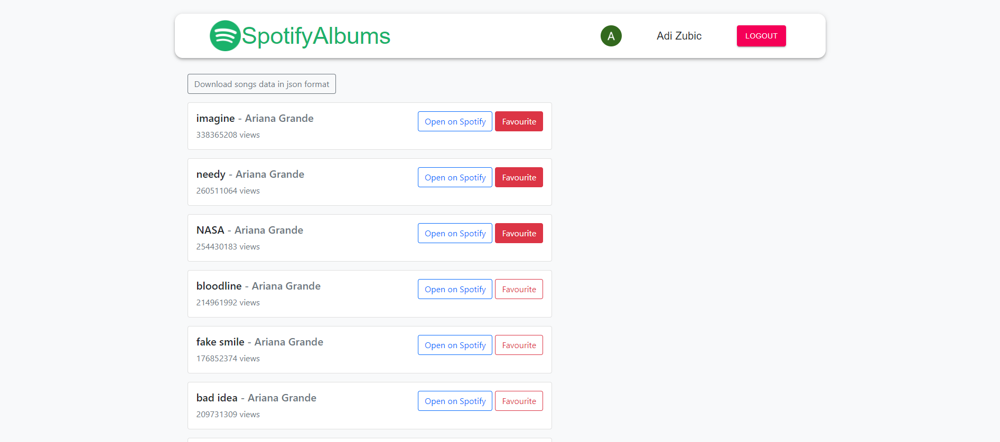

Softhouse Internship Program task documentation

App name: Spotify Albums

Setup: Provide an api key and MongoDB database connection string to the .env files, run 'npm install' and 'npm start' for both client and server to run the app

The app loads an array of songs from an album and shows them on the website. Songs have details such as name and view count, as well as a button which opens the song in the official spotify app. The user can sign in or sign up. If the user chooses to do so, the user can set a song as a favourite for his account. Favourite songs of other accounts do not change. If the user is not logged in, no songs are marked as favourite.

I focused on the MERN stack. Front-end was built with React.js, back-end with express.js. I used MongoDB Cloud Atlas as my database, and I used an api from rapidapi.com for the songs data. The user has two options to sign up/in: using a standard form, or Google OAuth. While the user is signed in, an object with his info and his token is stored in local storage. The token in question is a JWT, it expires after one hour. Passwords are hashed with bcrypt.js.

